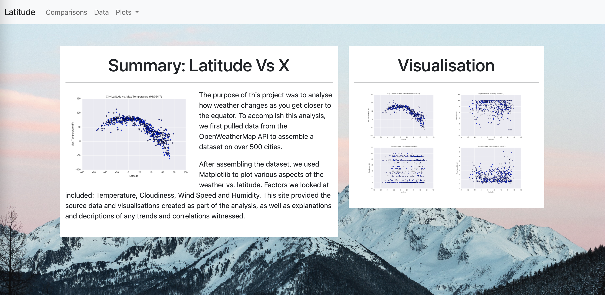
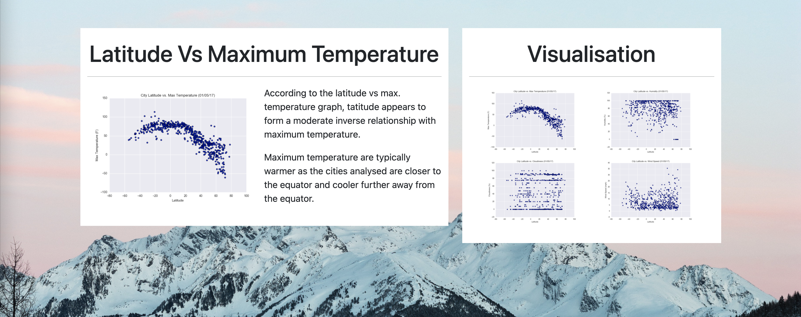
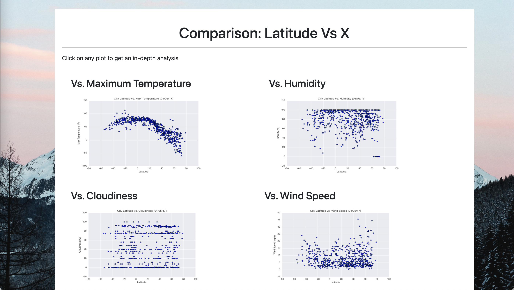
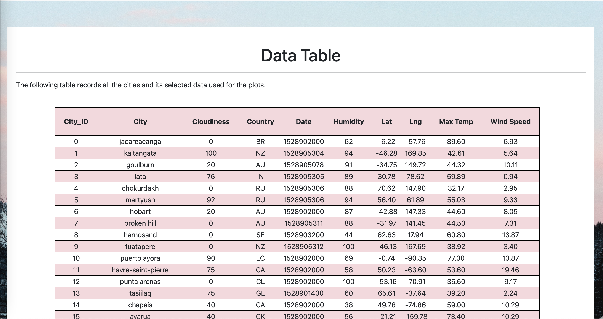

# **Web Design Challenge: Web Visualisation Dashboard (Latitude)**

Using HTML, CSS and Bootstrap to create a Web Visualisation Dashboard of the data colected from the Python API Challenge. 

 

# Web Visualisation Dashboard

**1. Landing Page**

Contains an explanation of the project and links to each visualisations page. The sidebar contains preview images of each plot, and clicking an image should take the user to that visualisation.

**2. Four Visualisation Pages**

These pages contains a descriptive title and heading tag.
The plot/visualisation itself for the selected comparison with a paragraph describing the plot and its significance.

**3. Comparison Page**

Contains all the visualisations on the same page so it can easily be visuble to the user

**4. Data Page**

Displays a table containing the data used in plotting the visualisations.

